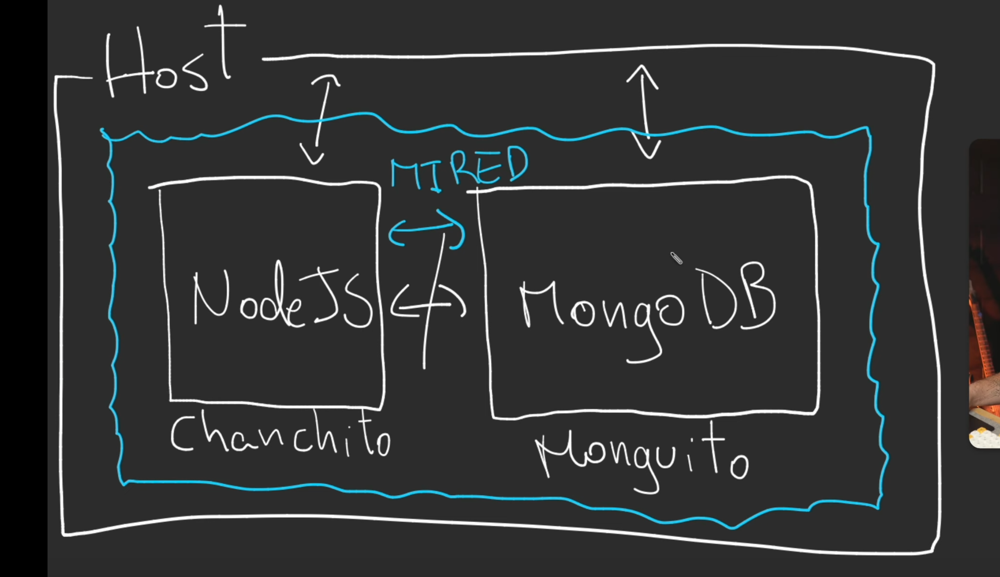

# CREATE CONTAINER
```
docker create NAME_image
```

# START CONTAINER
```
docker start ID_CONTAINER
`````

# SHOW ALL CONTAINERS
```
docker ps -a
```

# CREATE CONTAINER WITH PORT MAPPING
```
docker create -pPORT_OUR_MACHINE:PORT_APP_CONTAINER --name PERSONAL_NAME2CONTAINER IMAGE_NAME 
````

# SHOW LOGS OF CONTAINERS
```
docker logs CONTAINER_NAME (add --follow if you want to keep lisent the logs)
```


# IF YOU WANT RUN ALL A THESE IN ONA LINE USE:
```
docker run IMAGE_NAME (download image and create a container)
docker run -d IMAGE_NAME (run as daemon)
docker run -pPORT_OUR_MACHINE:PORT_APP_CONTAINER --name PERSONAL_NAME2CONTAINER IMAGE_NAME 
```

# CREATE A CONTAINER WITH A ENVIRONMENT VARIABLE
```
docker create -e ENVIRONMENT_VARIABLE=VALUE_ENVIRONMENT_VARIABLE IMAGE_NAME
docker create -p27017:27017 -e MONGO_INITDB_ROOT_USERNAME=nico -e MONGO_INITDB_ROOT_PASSWORD=password --name monguito mongo
```

# CREATE INTERNAL NETWORK FOR CONTAINERS


# LIST NETWORKS
```
docker network ls
```

# CREATE NETWORK
```
docker network create NAME_NETWORK
docker network create mired
```

# BUILD IMAGE FROM DOCKERFILE
```
docker build -t YOUR_NAME_IMAGE:ANY .
```

# CREATE CONTAINER WITH NETWORK
```
docker create --network NAME_NETWORK IMAGE_NAME
docker create -p27017:27017 --network mired -e MONGO_INITDB_ROOT_USERNAME=nico -e MONGO_INITDB_ROOT_PASSWORD=password --name monguito mongo
docker create -p3000:3000 --network mired --name chanchito miapp:1
``` 

# UP DOCKER COMPOSE
```
docker-compose up
```


# DOWN DOCKER COMPOSE
```
docker-compose down
```


# BASICLY WE RESUME THE COMMANDS IN THIS WAY:
```
docker create -p27017:27017 --network mired -e MONGO_INITDB_ROOT_USERNAME=nico -e MONGO_INITDB_ROOT_PASSWORD=password --name monguito mongo
docker create -p3000:3000 --network mired --name chanchito miapp:1
```
for docker-compose.yml


# FOR UP COMPOSE
```
docker-compose up -d
```

# NOTE
VOLUMES IS FOR PERSTENCE DATA

# CREATE DEVELOPMENT ENVIRONMENT
1. Create a [Dockerfile.dev](Dockerfile.dev)
2. Create a [docker-compose-dev.yml](docker-compose-dev.yml)

# RUN DEVELOPMENT ENVIRONMENT
```
docker-compose -f docker-compose-dev.yml up
```


